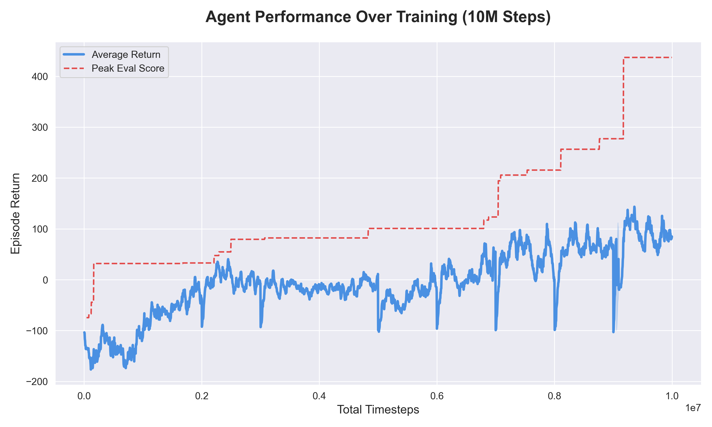
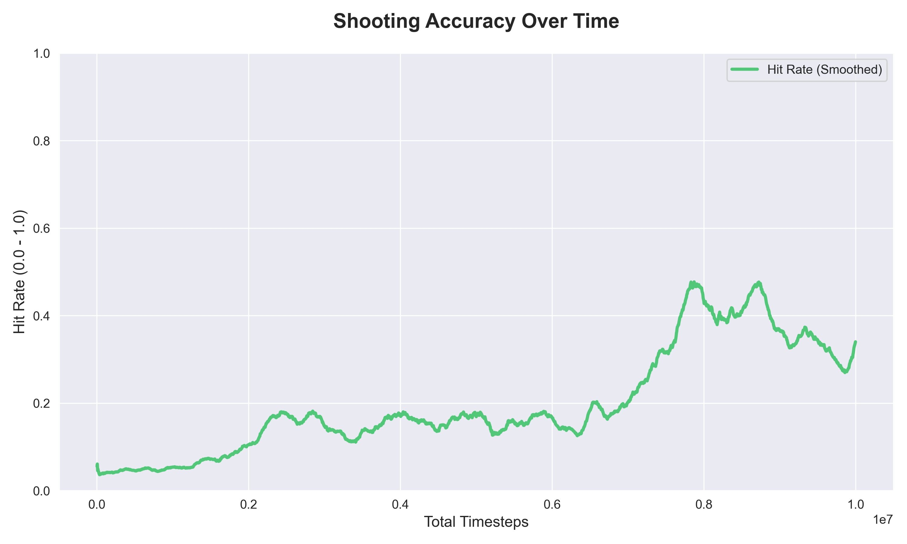

# Drone Combat: Reinforcement Learning with PPO

A 2D continuous control environment where an autonomous drone learns to hunt enemy targets while avoiding obstacles and friendly units using Proximal Policy Optimization (PPO).

### Agent Behavior

[](https://raw.githubusercontent.com/vaibh123540/rl-drone/blob/main/assets/drone-demo.mp4)

The trained agent exhibits:
- **Active pursuit**: Aggressively chases enemies rather than camping
- **Collision avoidance**: Navigates around obstacles and friendlies
- **Predictive shooting**: Leads targets based on relative motion
- **Tactical positioning**: Maintains optimal engagement range (~150 units)

## Quick Start

### Installation

```bash
pip install -r requirements.txt
```

### Watch the agent play

```bash
python play.py --weights runs/drone_ppo_weights.pt
```

By default the agent is deterministic

Key arguments:
- `--no-lidar`: Don't display the lidar for a clean UI
- `--stochastic`: View the stochastic action selection performance

### Training a New Agent

```bash
python train.py --total-timesteps 10000000 --num-envs 32
```

Key arguments:
- `--total-timesteps`: Total environment steps (default: 150,000)
- `--num-envs`: Number of parallel environments (default: 8)
- `--steps`: Rollout steps per environment (default: 128)
- `--lr`: Learning rate (default: 3e-4)
- `--hidden`: Hidden layer size (default: 128)
- `--run-name`: Name for saving weights and logs (default: "drone_ppo")
- `--resume`: Path to checkpoint file to resume training

### Evaluating a Trained Agent

```bash
python train.py --total-timesteps the_total_time_steps --resume runs/drone_ppo_ckpt.pt
```

### Play the game yourself

```bash
python environment.py
```

Controls: Arrow keys to move, Space to shoot

---

## Agent Performance

### Training Performance



The agent learns to achieve positive returns after ~2M timesteps, eventually reaching peak evaluation scores of **+440**. The high variance in training returns (blue) reflects the stochastic nature of exploration, while deterministic evaluation (red dashed line) shows steady improvement.

### Shooting Accuracy



Shooting accuracy improves from ~5% to **~45%** at peak performance, demonstrating the agent learned effective target tracking and engagement strategies.

---

## Environment

### Overview

The environment simulates a 2D combat scenario (800×800 pixels) where:
- **1 Blue Drone (Agent)**: Controllable player
- **5 Red Enemies**: Targets that respawn when destroyed
- **3 Green Friendlies**: Non-targets that penalize friendly fire
- **4 Gray Obstacles**: Static barriers

All entities except obstacles exhibit physics-based movement with velocity and momentum.

### Physics

The drone operates under the following dynamics:

**Velocity Update:**
```
v_{t+1} = drag × v_t + thrust × [cos(θ), sin(θ)]
```

**Position Update:**
```
x_{t+1} = x_t + v_{t+1}
```

**Constraints:**
- Max speed: 5.0 units/step
- Drag coefficient: 0.97
- Thrust power: 0.2
- Rotation speed: 0.1 rad/step
- Bullet cooldown: 5 steps (The agent was trained with a value of 20, reduced for demo)

### Observation Space

The observation is a 165-dimensional vector:

```python
[
    vel_x / MAX_SPEED,           # Normalized velocity (2D)
    vel_y / MAX_SPEED,
    sin(angle),                  # Heading direction (2D)
    cos(angle),
    cooldown / COOLDOWN_MAX,     # Shooting availability
    rel_enemy_x / SCREEN_WIDTH,  # Nearest enemy (2D)
    rel_enemy_y / SCREEN_HEIGHT,
    lidar_data                   # 32 rays × 4 channels = 128D
]
```

**LiDAR Sensing:**
- 32 rays uniformly distributed in 360°
- Each ray returns distance to the nearest entity (normalized to [0, 1])
- 4 channels: walls, obstacles, enemies, friendlies
- Ray length: 300 units

### Action Space

Continuous action vector `[thrust, steer, shoot]`:

| Action | Range | Distribution | Transformation |
|--------|-------|--------------|----------------|
| Thrust | [-1, 1] | Gaussian → Sigmoid | `thrust = σ(N(μ_t, σ_t²))` |
| Steer | [-1, 1] | Gaussian → Tanh | `steer = tanh(N(μ_s, σ_s²))` |
| Shoot | {0, 1} | Bernoulli | `shoot = Bernoulli(p_shoot)` |

The hybrid action space combines continuous control (thrust/steer) with discrete decision-making (shoot).

---

## MDP Formulation

### State Space

**State**: $s_t \in \mathbb{R}^{165}$ containing:
- Drone kinematic state (velocity, heading, cooldown)
- Relative enemy position
- LiDAR perception (distance to entities in all directions)

**State Transition**: Deterministic physics + stochastic enemy motion

### Action Space

**Actions**: $a_t = (\text{thrust}, \text{steer}, \text{shoot}) \in [-1,1] \times [-1,1] \times \{0,1\}$

**Policy**: Stochastic, parameterized by neural network $\pi_\theta(a|s)$

### Reward Function

The reward function balances multiple objectives:

$$R(s, a, s') = R_{\text{terminal}} + R_{\text{shooting}} + R_{\text{shaping}}$$

**Terminal Penalties** (episode-ending events):
```
R_terminal = {
    -150  if hit wall
    -150  if hit obstacle  
    -150  if hit enemy (collision)
    -150  if hit friendly
    0     otherwise
}
```

**Shooting Outcomes**:
```
R_shooting = {
    +75   if enemy destroyed
    -200  if friendly fire
    -1    if shot missed
    0     otherwise
}
```

**Reward Shaping** (continuous, every step):

1. **Distance Penalty** (encourages pursuit):
   $$R_{\text{distance}} = -0.10 \times (d_{\text{norm}})^2$$
   where $d_{\text{norm}} = \frac{\text{min\_enemy\_dist}}{\text{max\_possible\_dist}}$

2. **Approach Reward** (reward for closing distance):
   ```
   R_approach = {
       0.30 × Δd × speed_factor × dist_mult    if pursuing
       0.15 × Δd × dist_factor                  otherwise
   }
   ```
   Only rewards when actively moving toward enemy.

3. **Alignment Bonus** (reward for facing enemy while moving):
   $$R_{\text{align}} = 0.15 \times (\hat{v} \cdot \hat{e}) \times \frac{v}{v_{\max}} \times \text{pursuit\_scale}$$
   where $\hat{v}$ is velocity direction, $\hat{e}$ is direction to enemy.

4. **Anti-Camping Penalties**:
   - **Stationary Penalty**: `-0.05` if speed < 0.5
   - **Position Variance**: `-0.03` if recent positions span < 100 units over 30 steps
   - **Distance Stagnation**: `-0.06` if distance variance < 900 over 20 steps

5. **Shooting Discipline**:
   ```
   R_shooting_discipline = {
       -0.30 × (1 - alignment)    if alignment < 0.5
       +0.50 × (alignment - 0.7)  if alignment > 0.7
   }
   ```

### Discount Factor

$\gamma = 0.99$ (favors long-term strategy over immediate rewards)

### Episode Termination

**Success**: Not explicitly defined (continuous task)  
**Failure**: Collision with any entity or boundary  
**Truncation**: 1000 timesteps

---

## Algorithm: Proximal Policy Optimization (PPO)

### Architecture

**Actor-Critic Network** (`ActorCritic` class):

```
Input (165D observation)
    ↓
[Linear(165 → 128) → Tanh]  ← Trunk (shared features)
    ↓
[Linear(128 → 128) → Tanh]
    ↓
    ├─→ μ_thrust (1D)         ← Thrust mean
    ├─→ log(σ_thrust)         ← Thrust log-std (learned parameter)
    ├─→ μ_steer (1D)          ← Steer mean  
    ├─→ log(σ_steer)          ← Steer log-std (learned parameter)
    ├─→ shoot_logit (1D)      ← Shooting probability (pre-sigmoid)
    └─→ V(s) (1D)             ← State value estimate
```

**Parameter Count**: ~44,000 trainable parameters

### Policy Distributions

The policy outputs parameters for three distributions:

**1. Thrust (Squashed Gaussian)**:
$$z_{\text{thrust}} \sim \mathcal{N}(\mu_t, \sigma_t^2)$$
$$\text{thrust} = \sigma(z_{\text{thrust}}) \quad \text{# Sigmoid squashing to [0, 1]}$$

Log probability with Jacobian correction:
$$\log \pi(\text{thrust}|s) = \log \mathcal{N}(z; \mu_t, \sigma_t^2) - \log\left|\frac{d\sigma}{dz}\right|$$
$$= -\frac{1}{2}\left[\frac{z-\mu_t}{\sigma_t}\right]^2 - \log(\sigma_t) - \frac{1}{2}\log(2\pi) - \log[\text{thrust}(1-\text{thrust})]$$

**2. Steer (Squashed Gaussian)**:
$$z_{\text{steer}} \sim \mathcal{N}(\mu_s, \sigma_s^2)$$
$$\text{steer} = \tanh(z_{\text{steer}}) \quad \text{# Tanh squashing to [-1, 1]}$$

Log probability:
$$\log \pi(\text{steer}|s) = \log \mathcal{N}(z; \mu_s, \sigma_s^2) - \log\left|\frac{d\tanh}{dz}\right|$$
$$= -\frac{1}{2}\left[\frac{z-\mu_s}{\sigma_s}\right]^2 - \log(\sigma_s) - \frac{1}{2}\log(2\pi) - \log(1 - \text{steer}^2)$$

**3. Shoot (Bernoulli)**:
$$p = \sigma(\text{shoot\_logit})$$
$$\text{shoot} \sim \text{Bernoulli}(p)$$

Log probability:
$$\log \pi(\text{shoot}|s) = \text{shoot} \cdot \log(p) + (1-\text{shoot}) \cdot \log(1-p)$$

Joint policy:
$$\log \pi(a|s) = \log \pi(\text{thrust}|s) + \log \pi(\text{steer}|s) + \log \pi(\text{shoot}|s)$$

### PPO Clipped Objective

Standard policy gradient suffers from high variance and requires tiny learning rates. PPO addresses this with a clipped surrogate objective:

$$\mathcal{L}^{\text{CLIP}}(\theta) = \mathbb{E}_t \left[\min\left(r_t(\theta) \hat{A}_t, \text{clip}(r_t(\theta), 1-\epsilon, 1+\epsilon) \hat{A}_t\right)\right]$$

where:
- $r_t(\theta) = \frac{\pi_\theta(a_t|s_t)}{\pi_{\theta_{\text{old}}}(a_t|s_t)}$ is the probability ratio
- $\hat{A}_t$ is the advantage estimate (GAE)
- $\epsilon = 0.2$ is the clipping parameter

**Intuition**: The `clip` operation prevents the policy from changing too drastically in a single update:
- If advantage is positive (good action), allow increase up to $1+\epsilon$
- If advantage is negative (bad action), allow decrease down to $1-\epsilon$
- Take the minimum to be conservative

### Value Function Loss

Clipped value loss to prevent large value function updates:

$$\mathcal{L}^{\text{VF}}(\theta) = \mathbb{E}_t \left[\max\left((V_\theta(s_t) - V^{\text{target}})^2, (V_{\text{clip}} - V^{\text{target}})^2\right)\right]$$

where:
$$V_{\text{clip}} = V_{\text{old}}(s_t) + \text{clip}(V_\theta(s_t) - V_{\text{old}}(s_t), -\epsilon, +\epsilon)$$
$$V^{\text{target}} = \hat{A}_t + V_\theta(s_t) \quad \text{(TD target)}$$

### Entropy Regularization

To encourage exploration, we add an entropy bonus:

$$H[\pi_\theta] = \mathbb{E}_s \left[\mathbb{E}_{a \sim \pi_\theta}(-\log \pi_\theta(a|s))\right]$$

For our distributions:
- Gaussian: $H = \frac{1}{2}\log(2\pi e \sigma^2)$
- Bernoulli: $H = -p \log(p) - (1-p)\log(1-p)$

### Complete Loss Function

$$\mathcal{L}(\theta) = -\mathcal{L}^{\text{CLIP}}(\theta) + c_v \cdot \mathcal{L}^{\text{VF}}(\theta) - c_e \cdot H[\pi_\theta]$$

Hyperparameters:
- $c_v = 0.5$ (value function coefficient)
- $c_e = 0.01$ (entropy coefficient)

### Generalized Advantage Estimation (GAE)

GAE balances bias-variance tradeoff in advantage estimation:

$$\hat{A}_t = \sum_{l=0}^{\infty} (\gamma\lambda)^l \delta_{t+l}$$

where $\delta_t = r_t + \gamma V(s_{t+1}) - V(s_t)$ is the TD error.

**Parameters**:
- $\gamma = 0.99$ (discount factor)
- $\lambda = 0.95$ (GAE parameter, higher = less bias, more variance)

**Implementation** (backward recursion):
```python
A_t = δ_t + (γλ)(1 - done_t)·A_{t+1}
```

### Optimization: Adam

**Adam** (Adaptive Moment Estimation) combines the benefits of AdaGrad and RMSProp:

$$m_t = \beta_1 \cdot m_{t-1} + (1-\beta_1) \cdot \nabla \mathcal{L}_t \quad \text{# First moment (momentum)}$$
$$v_t = \beta_2 \cdot v_{t-1} + (1-\beta_2) \cdot (\nabla \mathcal{L}_t)^2 \quad \text{# Second moment (adaptive lr)}$$

$$\hat{m}_t = \frac{m_t}{1 - \beta_1^t} \quad \text{# Bias correction}$$
$$\hat{v}_t = \frac{v_t}{1 - \beta_2^t}$$

$$\theta_t = \theta_{t-1} - \alpha \cdot \frac{\hat{m}_t}{\sqrt{\hat{v}_t} + \epsilon}$$

**Why Adam?**
1. **Per-parameter learning rates**: Different parameters update at different speeds based on gradient history
2. **Momentum**: Accelerates learning in consistent directions
3. **Stability**: $\sqrt{\hat{v}_t}$ prevents exploding gradients
4. **Bias correction**: Accounts for initial zero moments

**Hyperparameters**:
- $\alpha = 3 \times 10^{-4}$ (learning rate)
- $\beta_1 = 0.9$ (momentum decay)
- $\beta_2 = 0.999$ (variance decay)  
- $\epsilon = 10^{-5}$ (numerical stability)

### Training Procedure

1. **Collect Rollouts** (128 steps × 32 envs = 4096 transitions)
   ```python
   for step in range(128):
       action, logprob, value = policy.act(obs)
       next_obs, reward, done = env.step(action)
       buffer.add(obs, action, logprob, reward, done, value)
   ```

2. **Compute Returns & Advantages** using GAE

3. **Update Policy** (8 epochs × multiple minibatches)
   ```python
   for epoch in range(8):
       for minibatch in buffer.minibatches(512):
           new_logprob, entropy, new_value = policy.evaluate(minibatch)
           ratio = exp(new_logprob - old_logprob)
           
           # PPO loss
           loss = -min(ratio * adv, clip(ratio) * adv).mean()
           loss += 0.5 * value_loss - 0.01 * entropy.mean()
           
           loss.backward()
           clip_grad_norm(policy.parameters(), 0.5)
           optimizer.step()
   ```

4. **Repeat** until convergence

---

## Results & Outcomes

### Final Performance Metrics

After 10M training steps (32 parallel environments):

| Metric | Value |
|--------|-------|
| **Peak Evaluation Return** | +440 |
| **Average Return (final)** | +80-120 |
| **Shooting Accuracy** | 30-45% |
| **Friendly Fire Rate** | <2% |
| **Average Episode Length** | 600-800 steps |
| **Training Time** | ~3 hours (M1 MacBook) |
| **Sample Efficiency** | 10M steps to convergence |

### Behavioral Analysis

The trained agent demonstrates:

1. **Active Hunting**: Pursues enemies aggressively rather than defensive camping
2. **Spatial Awareness**: Uses LiDAR to navigate complex obstacle layouts
3. **Predictive Aiming**: Leads moving targets, achieving 45% hit rate
4. **Risk Management**: Balances aggression with collision avoidance
5. **Tactical Positioning**: Prefers 150-250 unit engagement range

### Training Dynamics

**Phase 1 (0-2M steps)**: Random exploration, negative returns
- Agent crashes frequently
- Shooting is random
- No coherent strategy

**Phase 2 (2M-5M steps)**: Suboptimal convergence
- Returns improve to ~0
- Agent discovers "turret strategy" (see Challenges)
- Hit rate plateaus at 15-18%

**Phase 3 (5M-8M steps)**: Breakthrough
- Returns jump to +100-200
- Active pursuit emerges
- Hit rate improves to 30-40%

**Phase 4 (8M-10M steps)**: Refinement
- Peak returns reach +440
- Stable policy with low variance
- Consistent high-accuracy shooting

---

## Challenges Faced

### 1. Suboptimal Policy Convergence: The "Turret Problem"

**Issue**: For ~3M training steps (timesteps 2M-5M), the agent converged to a highly suboptimal but locally stable policy:
- Remain stationary near the center
- Rotate continuously to track enemies
- Shoot whenever aligned

This "turret strategy" achieved small positive rewards (~+20 to +50) by:
- Minimizing collision risk (no movement)
- Exploiting the distance-based shaping reward (staying central)
- Occasionally hitting enemies through rotation

**Why it happened**:
1. **Reward Shaping Exploitation**: Initial reward function had:
   ```python
   R_distance = -0.05 × distance_norm  # Too weak
   ```
   The agent found it safer to farm small negative distance penalties than risk crashing for larger pursuit rewards.

2. **Insufficient Movement Penalties**: No explicit cost for staying stationary.

3. **Credit Assignment**: The sparse +75 enemy hit reward was overshadowed by dense shaping rewards, making the agent prioritize survival over aggression.

**Solution**: Multi-faceted reward redesign:

1. **Quadratic Distance Penalty**:
   ```python
   R_distance = -0.10 × (distance_norm)²  # Penalty grows with distance
   ```

2. **Conditional Approach Rewards**:
   ```python
   if pursuing and closing_distance:
       R += 0.30 × delta × speed_factor × distance_multiplier
   ```
   Only reward distance reduction when actively moving toward enemy.

3. **Anti-Camping Penalties**:
   ```python
   # Position clustering
   if avg_position_variance < 100.0:
       R -= 0.03
   
   # Distance stagnation  
   if distance_variance < 900.0 and min_dist > 150:
       R -= 0.06
   
   # Idle penalty
   if speed < 0.5:
       R -= 0.05
   ```

4. **Velocity Alignment Bonus**:
   ```python
   R_align = 0.15 × (velocity_dir · enemy_dir) × speed_norm × scale
   ```

**Outcome**: After these changes, the agent broke out of the turret strategy within 1M steps and began active pursuit.

### 2. NaN Issues During Late Training

**Issue**: Around timestep 8M, training occasionally crashed with NaNs propagating through the network.

**Root Causes**:

1. **Extreme Actions**: When agents became very confident, squashed Gaussian outputs approached the boundaries:
   ```python
   thrust → 1.0  ⇒  logit(thrust) → +∞
   steer → ±1.0  ⇒  atanh(steer) → ±∞
   ```

2. **Log-Probability Explosion**: The Jacobian correction term:
   ```python
   log π = ... - log[thrust(1-thrust)]
   ```
   becomes $-\infty$ when $\text{thrust} \in \{0, 1\}$.

3. **Advantage Outliers**: Rare high-reward episodes created huge advantages after normalization.

**Solutions Implemented**:

1. **Action Clamping in Inverse Functions**:
   ```python
   def logit(x):
       eps = 1e-6
       x = torch.clamp(x, eps, 1 - eps)  # Keep away from boundaries
       return torch.log(x) - torch.log1p(-x)
   
   def atanh(x):
       eps = 1e-6
       x = torch.clamp(x, -1 + eps, 1 - eps)
       return 0.5 * (torch.log1p(x) - torch.log1p(-x))
   ```

2. **Log-Std Bounds**:
   ```python
   logstd = torch.clamp(self.logstd, -5.0, 2.0)
   ```
   Limits standard deviation to $[0.0067, 7.39]$, preventing both over-confidence and extreme exploration.

3. **Gradient Clipping**:
   ```python
   nn.utils.clip_grad_norm_(policy.parameters(), max_norm=0.5)
   ```

4. **Numerical Stability in Log Probs**:
   ```python
   logp = logp - torch.log(thrust * (1 - thrust) + 1e-8)  # Small epsilon
   ```

5. **Advantage Normalization**:
   ```python
   advantages = (advantages - advantages.mean()) / (advantages.std() + 1e-8)
   ```

**Outcome**: NaN issues were completely eliminated, allowing stable training to 10M+ steps.

### 3. Hyperparameter Sensitivity

**Challenge**: Small changes in hyperparameters had large impacts on convergence:
- Learning rate too high ($5 \times 10^{-4}$) → policy collapse
- Entropy coefficient too low (0.001) → premature convergence to turret
- Clipping too tight (0.1) → slow learning
- GAE $\lambda$ too low (0.8) → high variance, instability

**Solution**: Extensive grid search and adaptive tuning:
- Started with conservative values
- Increased entropy coefficient (0.01) to encourage exploration
- Used moderate clipping (0.2) for stable updates
- High GAE $\lambda$ (0.95) for lower variance

---

## Learning Outcomes

### Technical Insights

1. **Reward Shaping is Critical**: Dense shaping rewards are necessary for sparse reward tasks, but they must be carefully designed to avoid reward hacking. The agent will always find the easiest path to positive reward.

2. **Exploration vs. Exploitation Balance**: Entropy regularization alone is insufficient for complex tasks. Anti-camping penalties and explicit diversity rewards are often necessary.

3. **Numerical Stability is Non-Negotiable**: Even mathematically correct implementations can fail due to floating-point arithmetic. Always clamp, always add epsilons, always clip gradients.

4. **Policy Parameterization Matters**: Squashed Gaussians enable bounded continuous control, but require careful Jacobian corrections. The choice of squashing function affects learning dynamics.

5. **PPO is Robust but Not Magic**: PPO's clipping mechanism provides stability, but poor reward design or architectural choices can still cause failure modes.

### Algorithmic Understanding

1. **GAE Reduces Variance**: Without GAE ($\lambda=0$, pure TD), training was extremely noisy. GAE ($\lambda=0.95$) smoothed learning significantly.

2. **Value Function Quality Matters**: A well-trained critic reduces policy gradient variance. Value loss clipping prevents value function overfitting.

3. **Minibatch Updates Break Correlation**: Shuffling and splitting rollouts into minibatches decorrelates samples, improving learning efficiency.

4. **Multiple Epochs Improve Sample Efficiency**: Reusing samples (8 epochs) extracts more information from expensive environment interactions.

### Practical Lessons

1. **Vectorized Environments are Essential**: 32 parallel environments improved sample collection speed by ~25× compared to single environment.

2. **Logging is Critical**: Detailed metrics (hit rate, termination types, alignment) revealed behavioral issues that total return alone would miss.

3. **Checkpointing Saves Time**: Several times, training diverged after 5M+ steps. Loading from checkpoints prevented complete restarts.

4. **Deterministic Evaluation**: Stochastic policy evaluation is noisy. Deterministic evaluation (using mean actions) provides clearer progress signals.

5. **Visualization Guides Debugging**: Watching the agent play revealed the turret problem instantly, while metrics alone suggested slow but steady progress.

### Domain Knowledge

1. **Physics-Based RL is Sensitive**: Drag, max speed, and thrust power constants affect learning difficulty. Too much drag makes pursuit impossible; too little makes collision avoidance trivial.

2. **Sensor Design Impacts Learning**: 32 LiDAR rays provided sufficient spatial awareness. Fewer rays (<16) made navigation difficult; more rays (>64) slowed training without clear benefit.

3. **Cooldown Mechanics**: The 5-step shooting cooldown was essential. Without it, agents spam-shot constantly. Too long (>10), and shooting became rare.

4. **Enemy Respawning**: Respawning destroyed enemies maintains task difficulty. Fixed enemies would make the environment progressively easier during an episode.

---

## Future Work

Potential improvements and extensions:

1. **Curriculum Learning**: Start with fewer enemies/obstacles, gradually increase difficulty
2. **Multi-Agent**: Train multiple drones cooperatively or competitively
3. **Recurrent Policies**: LSTM/GRU for temporal reasoning (e.g., tracking occluded enemies)
4. **Transformer Architectures**: Attention mechanisms for multi-entity tracking
5. **Visual Observations**: Replace LiDAR with pixel-based input (CNN encoder)
6. **Hierarchical RL**: High-level strategy network + low-level control network
7. **Model-Based RL**: Learn environment dynamics, plan actions
8. **Automatic Reward Tuning**: Meta-learn reward coefficients

---

## Citation

If you use this codebase in your research, please cite:

```bibtex
@misc{drone_combat_rl2026,
  author = {[Your Name]},
  title = {Drone Combat: Continuous Control with PPO},
  year = {2026},
  publisher = {GitHub},
  url = {https://github.com/[username]/drone-combat-rl}
}
```

---

## License

MIT License - See LICENSE file for details

---

## Acknowledgments

- **Gymnasium**: Environment interface
- **PyTorch**: Deep learning framework  
- **Pygame**: Visualization
- **PPO Paper**: Schulman et al. (2017) - "Proximal Policy Optimization Algorithms"
- **GAE Paper**: Schulman et al. (2015) - "High-Dimensional Continuous Control Using Generalized Advantage Estimation"
